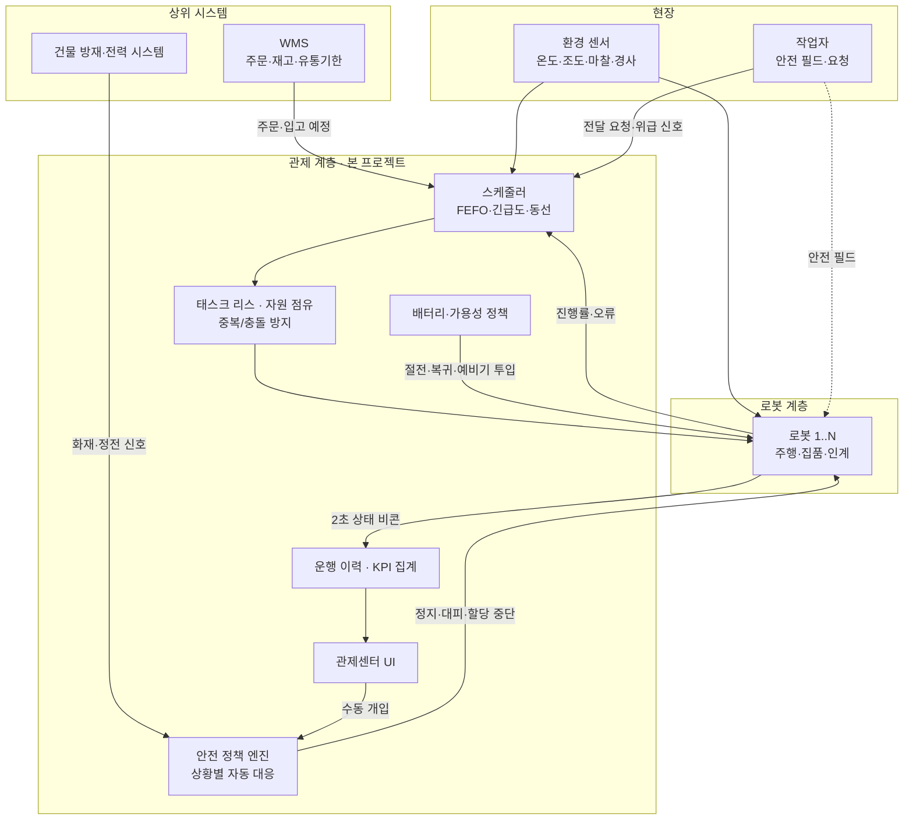
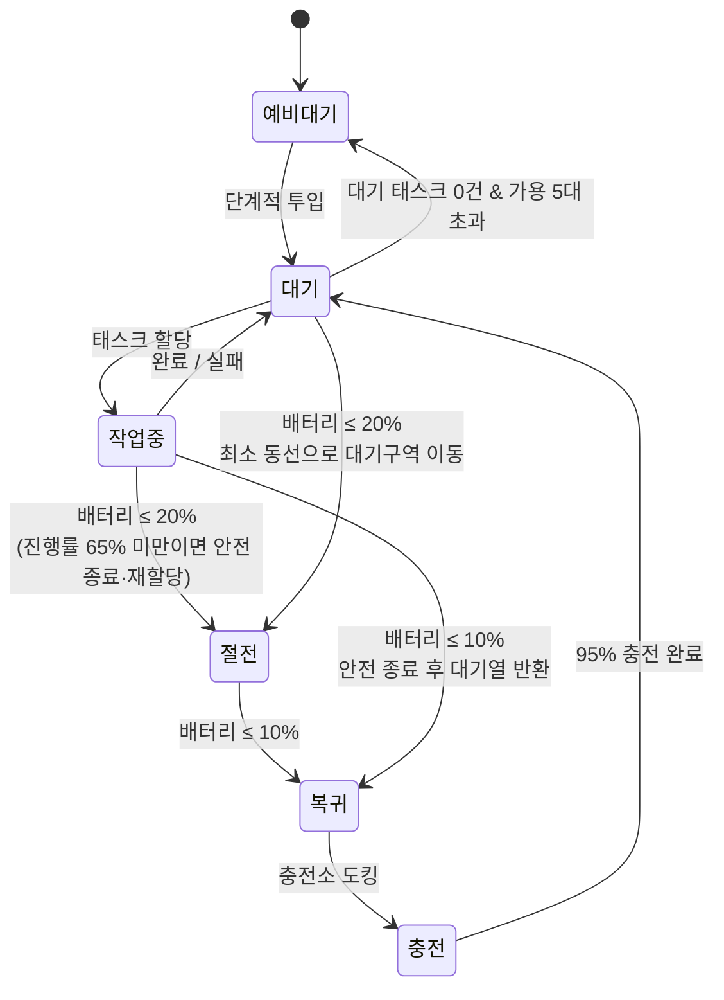
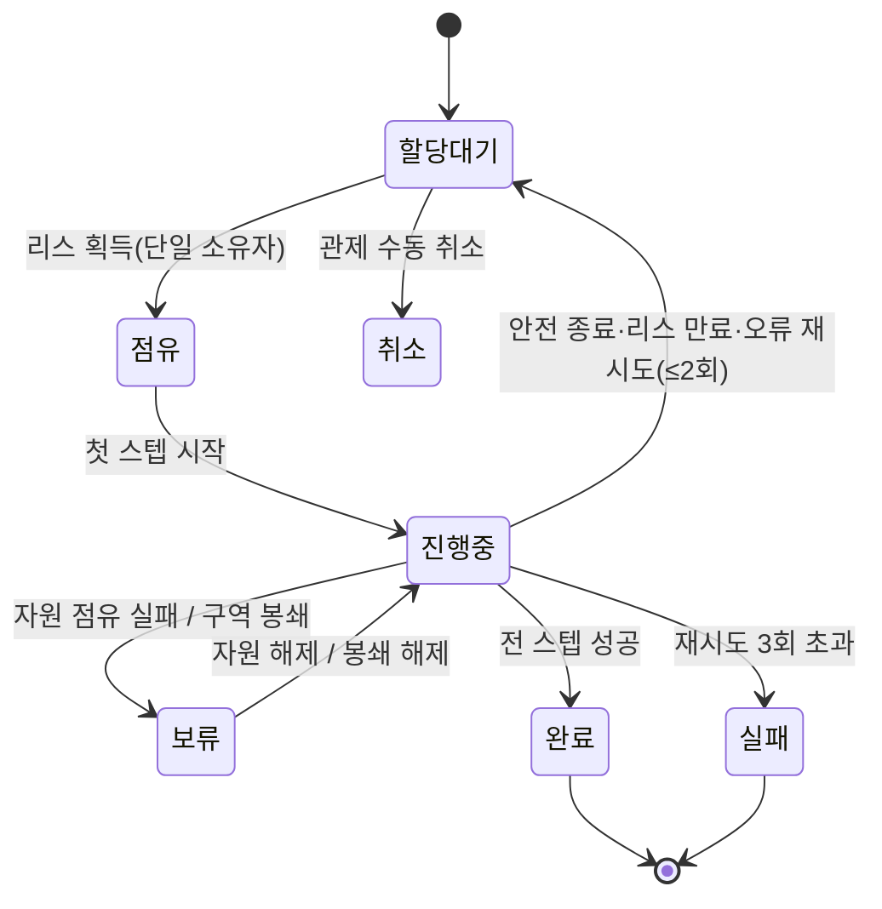

# 3온도 물류센터 자율주행 로봇 운영 시스템 — 프로젝트 요약

**문서 버전** 1.0 · **작성일** 2026-07-28 · **구현 저장소** `robo_control` (Flutter) · 공용 계층 `robo_core`

---

## 1. 개요

상온·냉장·냉동 3온도대가 한 건물에 공존하는 물류센터에서, 자율주행 로봇이
사람과 같은 공간에서 입·출고 작업과 작업자 지원 업무를 수행하도록 하는
시스템이다. 로봇 개체의 자율성보다 **여러 대를 동시에 안전하게 운영하는
통제 계층(FMS, Fleet Management System)** 이 이 프로젝트의 핵심이다.

본 저장소에는 그 통제 계층의 **관제센터 애플리케이션**과, 관제 로직을
검증할 수 있는 **결정론적 운영 시뮬레이터**가 함께 구현되어 있다.

### 대상 환경

| 항목 | 값 |
|---|---|
| 구획 | 상온(15~25℃) · 냉장(0~5℃) · 냉동(-25~-18℃) |
| 면적 | 논리 좌표 120 × 72 unit (1 unit ≈ 0.5 m, 약 60 m × 36 m) |
| 설비 | 입고 도크 2 · 출고 도크 2 · 충전소 4 · 작업 스테이션 3 · 대기 구역 2 · 비상 집결지 1 |
| 로봇 | 초기 8대 (상온·냉장 대응 5대 / 냉동 대응 3대, 이 중 2대는 예비기) |
| 작업자 | 초기 6명 (피킹 · 검수 · 포장) |

로봇과 작업자 수는 고정값이 아니다. 운영 중 관제 화면에서 등록·해제할 수 있으며,
그 결과가 스케줄링 대상과 안전 필드 계산에 즉시 반영된다(§2.7).

---

## 2. 요구사항 정리

원 요구사항 12개를 ID화하고, 각각이 시스템 어디에 구현되어 있는지 함께 정리한다.
마지막 §2.7은 원 요구를 운영에서 성립시키기 위해 도출한 추가 항목이다.

### 2.1 업무 수행

| ID | 요구사항 | 구현 |
|---|---|---|
| **REQ-01** | 입·출고 작업을 수행한다. | 입고: 도크 → 검수·스캔 → 로케이션 적치. 출고: FEFO 로트 → 집품 → 출고 도크 하역·검수. 4스텝 태스크로 모델링. `_spawnInbound()` / `_buildOutboundTask()` |
| **REQ-02** | 작업자 요청 작업을 수행한다(물건 건네주기, 작업자 간 전달). | `handover`(랙→작업자) · `relay`(작업자 A→작업자 B) 태스크 유형. 사람이 대기 중이므로 우선순위 점수에 +14 가산. |

### 2.2 안전

| ID | 요구사항 | 구현 |
|---|---|---|
| **REQ-03** | 안전 관리 프로세스를 제공한다(화재, 전원 차단, 작업자 위급). | 상황 유형별 **자동 대응 시퀀스**. 화재 → 전 로봇 작업 중지·비상 집결지 대피·신규 할당 중단. 전원 차단 → 해당 구획 정지·비상 조도 전환·측위 신뢰도 하향. 작업자 위급 → 반경 내 즉시 정지·구조 통로 확보. |
| **REQ-04** | 작업자와 로봇이 같은 공간에 안전하게 공존한다. | 2단 안전 필드 — **보호 필드 1.7 m 즉시 정지**, **경고 필드 4 m 35% 감속**. 인계 스텝은 작업자가 6 m 내 도착해야 진행. 로봇 간 5 m 이내 선행 차량에 감속 양보. |

### 2.3 스케줄링

| ID | 요구사항 | 구현 |
|---|---|---|
| **REQ-05** | FEFO · 주문 긴급도 · 이동 동선 기반으로 효율적으로 스케줄링한다. | 2단계 스코어링(아래 §4.2). 태스크 우선순위와 로봇 적합도를 분리해 계산한다. |
| **REQ-06** | 3온도 환경의 동적 변화(온도·조명·바닥 미끄러움·바닥 각도)에도 주행/작업 성능을 유지한다. | 구획별 환경 상태를 상시 추종하고 **주행 성능 지수**로 환산해 속도·작업 시간·측위 신뢰도에 실시간 반영(§4.4). |

### 2.4 다중 로봇 협업

| ID | 요구사항 | 구현 |
|---|---|---|
| **REQ-07** | 동일 작업의 중복 수행과 작업 정보 충돌을 방지한다. | **태스크 리스(lease) 레지스트리** — 단일 소유자 + TTL + 하트비트 갱신. 랙 슬롯·도크·스테이션은 **자원 점유표**로 배타 제어. |
| **REQ-08** | 각 로봇은 작업 여부뿐 아니라 현재 작업과 진행 상태를 공유한다. | 2초 주기 **상태 비콘**(상태·배터리·태스크 ID·진행률·현재 스텝·점유 자원)을 관제 및 타 로봇에 브로드캐스트. |

### 2.5 이력·기록

| ID | 요구사항 | 구현 |
|---|---|---|
| **REQ-09** | 주행 경로·작업 시간·오류·예외 등 운행 이력이 최신 상태로 관리된다. | 통합 이벤트 로그(주행/작업/배터리/안전/스케줄/환경/주문). 로봇별 주행 궤적·주행거리·가동시간·안전 정지 횟수 누적. |
| **REQ-10** | 작업 완료 시 주문 및 태스크별 성공·실패가 기록된다. | 태스크: 완료/실패/취소 + 실패 사유 + 재시도 횟수 + 사이클 타임. 주문: 라인별 성공·실패 집계 후 완료/부분완료/실패 + 납기 준수 여부 확정. |

### 2.6 배터리·가용성

| ID | 요구사항 | 구현 |
|---|---|---|
| **REQ-11** | 배터리 20% 이하 → 최소 동선으로 절전 모드, 10% 이하 → 충전소 복귀. | 20%: 절전 진입(속도 55%, 소모율 60%) + 가장 가까운 대기 구역/충전소로만 이동. 10%: 안전 종료 후 복귀 → 95%까지 충전. |
| **REQ-12** | 배터리 부족으로 전체 작업이 중단되지 않도록 안전 종료·재할당·단계적 투입이 가능하다. | 진행률 65% 미만 태스크는 대기열에 반환해 즉시 재할당, 65% 이상이면 감속 상태로 마무리. 가용 대수 감소 또는 대기 5건 이상 적체 시 **예비기 단계적 투입**, 적체 해소 시 예비 대기로 환원. |

### 2.7 자원 관리 (운영 요구 — 도출 항목)

원 요구사항에는 명시되지 않았으나, 위 12개 요구를 실제 운영에서 성립시키려면
플릿 구성이 고정되어서는 안 된다. 장비 입고·폐기·정비와 인원 교대가 실제로
일어나기 때문이다.

| ID | 요구사항 | 구현 |
|---|---|---|
| **REQ-13** | 로봇을 운영 중 등록·해제할 수 있어야 한다. | 등록 시 ID 자동 부여(기존 번호와 비충돌), 대응 구획에 맞는 홈 충전소 배정, 대기 구역 배치. 즉시 투입/예비 대기 선택. |
| **REQ-14** | 로봇 해제가 진행 중 작업을 유실시키지 않아야 한다. | 해제 시 진행 태스크를 **안전 종료 후 대기열로 반환**해 우선순위를 유지한 채 재할당. 점유 중이던 리스·랙 슬롯·충전소를 모두 회수하고 사유를 이력에 기록. |
| **REQ-15** | 작업자를 등록·해제할 수 있어야 한다. | 등록 즉시 안전 필드 감시 대상에 포함(REQ-04와 동일 규칙 적용). 위급 상태 작업자를 해제하면 연계된 안전 상황도 함께 종료. |

정비를 위한 일시 이탈은 해제가 아니라 **수동 회수 → 투입 재개**로 처리해,
로봇 이력과 누적 지표가 보존되도록 구분했다.

---

## 3. 시스템 아키텍처



### 계층별 책임

| 계층 | 책임 | 응답 시간 요구 |
|---|---|---|
| 로봇 내부 안전 (본 프로젝트 범위 밖) | 라이다 기반 보호 필드, 하드웨어 E-Stop | ≤ 100 ms, 안전 인증 필요 |
| 관제 안전 정책 | 상황 전파, 구역 봉쇄, 대피 유도, 할당 중단 | ≤ 1 s |
| 스케줄링·조정 | 태스크 배정, 자원 점유, 재할당 | ≤ 2 s |
| 이력·KPI | 이벤트 적재, 지표 집계 | 준실시간 |

> **주의**: 사람의 안전을 최종적으로 보장하는 것은 로봇 내부의 인증된 안전 회로다.
> 관제 계층의 정지 명령은 이를 보완하는 2차 계층으로 설계해야 한다.

---

## 4. 핵심 설계

### 4.1 중복 수행 방지 — 태스크 리스 (REQ-07)

분산 락과 동일한 계약을 사용한다.

```
claim(taskId, robotId, ttl):
    현재 소유자가 있고 · 만료 전이며 · 다른 로봇이면 → 거부(충돌 카운트 +1)
    그 외 → 승인, 만료 시각 = now + TTL(20초)

renew(taskId, robotId, ttl):   수행 중 하트비트로 연장
reapExpired(now):              TTL 만료 태스크 회수 → 대기열 반환 후 재할당
```

배정 시 **상위 2개 후보 로봇이 동시에 점유를 시도**하고 레지스트리가 한 대만
승인한다. 무응답 로봇이 태스크를 영구 점유하는 상황은 TTL 만료 회수로 해소된다.

랙 슬롯·도크·작업 스테이션은 별도의 자원 점유표로 배타 제어하며, 점유 실패한
로봇은 `자원 대기` 상태로 전환되어 대기한다.

### 4.2 스케줄링 스코어 (REQ-05)

**1단계 — 태스크 우선순위**

```
priority = 긴급도(가중 26) + FEFO(가중 30) + 대기시간(가중 12) + 납기임박(가중 18)
           + 작업자 요청 가산점(14)
```

- FEFO: 유통기한까지 남은 시간을 45일 기준으로 정규화한 임박도(0~1)
- 대기시간: 8분 기준 정규화 — 낮은 우선순위 태스크의 **기아(starvation) 방지**
- 납기: 잔여 45분 기준 정규화

**2단계 — 로봇 적합도(입찰)**

```
fitness = 동선점수(가중 22, 180 unit 기준 정규화) + 배터리점수(10)
          + 동일구획보너스(6) - 충전중페널티(12)
사전 필터: 구획 대응 등급 미달 / 배터리 22% 이하 /
          예상 소모량 반영 후 잔량 12% 미만 → 입찰 제외
```

동선 비용은 직선거리가 아니라 **통로 그래프 상 최단 경로 길이**(다익스트라)로
계산해 랙을 통과하는 비현실적 추정을 배제한다.

**FEFO 이탈 처리**: 1순위 로트가 다른 로봇에 점유되어 있으면 차순위 로트를
사용하고, 그 사유를 이력에 남겨 이탈로 집계한다(FEFO 준수율 KPI에 반영).

### 4.3 안전 정책 (REQ-03, REQ-04)

| 상황 | 자동 대응 |
|---|---|
| **화재** | 신규 할당 중단 → 진행 태스크 안전 종료·대기열 보류 → 비상 집결지 대피 경로 산출·이동 → 구획 전원 차단 요청 → 작업자 대피 통로 확보 |
| **전원 차단** | 해당 구획 로봇 즉시 정지 → 비상 조도(45 lx) 전환 및 측위 신뢰도 하향 → 구획 태스크 할당 중단 → 냉장·냉동 온도 상승 모니터링 강화 |
| **작업자 위급** | 반경 16 unit(8 m) 내 로봇 즉시 정지 → 구조 통로 확보 우회 경로 재계산 → 관리자 호출·이력 기록 → 구역 신규 진입 차단 |
| **전체 비상정지** | 전 로봇 동력 차단 → 태스크 리스 동결 → 수동 해제까지 할당 중단 |
| **바닥 결빙·오염** | 마찰계수 하향 반영 → 해당 구획 속도 자동 제한 → 청소·제빙 요청 발행 |

안전 판정은 로봇 상태 갱신 루프에서 **항상 최우선으로 평가**되며, 배터리 정책이나
태스크 진행보다 앞선다.

### 4.4 환경 적응 (REQ-06)

구획별 실시간 환경값을 성능 계수로 환산한다.

```
traction   = clamp(마찰계수 / 0.70, 0.45, 1.00)
visibility = clamp(조도 / 260 lx, 0.45, 1.00)
slope      = clamp(1 - |경사| / 12°, 0.60, 1.00)
주행 성능 지수 = traction × visibility × slope

허용 속도  = 3.4 u/s × 주행 성능 지수 × 절전계수 × 적재계수 × 안전필드계수
측위 신뢰도 = clamp(0.55 + 0.45 × visibility × traction, 0.40, 0.99)
             → 0.70 미만이면 추가 20% 감속
작업 시간  = 기준 시간 ÷ (0.5 + 0.5 × 주행 성능 지수)   // 저온 결로·저조도에서 증가
배터리 소모 = 기준 소모율 × 온도계수(냉동 1.35 / 냉장 1.12 / 상온 1.00)
```

기본 환경값: 상온 마찰 0.78·320 lx, 냉장 0.63·240 lx, 냉동 **0.52·180 lx·경사 2.1°**.
냉동 구역이 구조적으로 가장 불리하며, 성능 지수가 0.62 아래로 떨어지면 경고 이벤트와
함께 해당 구역 최고 속도가 자동 하향된다.

### 4.5 배터리·가용성 상태 기계 (REQ-11, REQ-12)



절전 진입 시 예비기 투입이 함께 요청되어 **가용 대수가 유지**되며, 반환된 태스크는
우선순위를 그대로 유지한 채 다른 로봇에 재할당된다.

---

## 5. 도메인 모델

| 엔티티 | 주요 속성 |
|---|---|
| **Robot** | 상태, 위치·방위, 배터리, 대응 구획 등급, 현재 태스크·진행률, 경로·궤적, 점유 자원, 측위 신뢰도, 누적 주행/가동/완료/실패/인계/안전정지 |
| **WorkTask** | 유형(입고·출고·전달·중계·보충·회수), 긴급도, 구획, 스텝 목록, 상태, 담당 로봇, 재시도, 실패 사유, 사이클 타임, 우선순위 점수 |
| **TaskStep** | 종류(이동·집품·하역·검수·인계·대기), 목표 좌표, 소요 시간, 점유 자원 |
| **SalesOrder** | 고객, 긴급도, 납기, 라인 수, 성공/실패 라인, 마감 시각, 정시 여부 |
| **Lot** | SKU, 구획, 로케이션, 수량/예약, 유통기한, 임박도, 입고일 |
| **ZoneEnvironment** | 온도, 조도, 마찰, 경사, 습도, 전원 상태, 성능 계수 |
| **Worker** | 이름, 역할, 구획, 위치, 위급 여부, 전달 대기 여부 |
| **Incident** | 유형, 발생/해제 시각, 대상 구획·좌표·반경, 자동 대응 조치 목록 |
| **OpsEvent** | 시각, 심각도, 분류, 발생 주체, 메시지, 연관 태스크·주문 |

### 태스크 수명주기



---

## 6. KPI 정의

| 지표 | 정의 |
|---|---|
| 시간당 처리량 | 최근 60분(5분 × 12구간) 완료 태스크 수 |
| 태스크 성공률 | 완료 ÷ (완료 + 실패) |
| 주문 정시 납기율 | 마감된 주문 중 `마감 시각 ≤ 납기`인 비율 |
| 평균 사이클 타임 | 태스크 시작 → 완료까지 평균 소요 초 |
| FEFO 준수율 | 1순위 로트 출고 ÷ (1순위 + 차순위 대체) |
| 주행 성능 지수 | 3개 구획 성능 지수의 평균 |
| 안전 정지 횟수 | 안전 정책에 의한 정지 누적 |
| 중복 수행 차단 | 리스 충돌로 반려된 점유 시도 수 |
| 태스크 재할당 | 배터리·안전·오류로 대기열에 반환된 횟수 |

---

## 7. 관제센터 앱 구성

| 화면 | 내용 | 대응 요구사항 |
|---|---|---|
| **종합 현황** | 12개 핵심 지표, 5분 구간 처리량 차트(표 보기 전환 가능), 3온도 환경 패널, 로봇 상태 공유 목록, 최근 이벤트 | 전체 |
| **실시간 맵** | 구획·랙·통로·설비 평면도, 로봇 위치/방위/배터리 링/경로/궤적, 작업자 안전 필드, 안전 상황 반경, 점유 랙 슬롯 표시 | REQ-04, 06, 07 |
| **로봇 관제** | 2초 주기 상태 비콘 테이블(상태·배터리·태스크·진행률·현재 작업·점유 자원), 배터리 정책 현황, 로봇 등록·해제, 개별 로봇 상세·수동 회수/투입 | REQ-08, 11, 12 |
| **태스크·주문** | 우선순위 정렬 대기열, 스텝별 진행 상황, 재할당·취소, 스케줄링 가중치, 주문별 성공·실패·납기 | REQ-01, 02, 05, 10 |
| **재고 · FEFO** | 유통기한 임박 순 로트 목록, 임박도 미터, D-3 이내 목록, FEFO 준수/이탈 지표 | REQ-05 |
| **안전 관리** | 상황 발령·해제 콘솔, 자동 대응 조치 체크리스트, 인간-로봇 공존 규칙, 작업자 등록·해제 및 최근접 로봇 거리·필드 상태 | REQ-03, 04 |
| **운행 이력** | 분류·심각도 필터, 최근 400건 통합 이력 | REQ-09, 10 |

상단 바에서 전체 비상정지 발령/해제, 시뮬레이션 일시정지, 배속(1×~8×) 조정이 가능하다.

### 화면 설계 원칙

- **단일 라이트 팔레트**. 계열색·상태색은 dataviz 레퍼런스 팔레트의 라이트 컬럼을
  값 변경 없이 사용해, 인접 쌍 CVD 및 일반 시야 분리 기준을 만족시킨다
- 라이트 서피스에서 3:1 대비에 못 미치는 색(aqua·yellow·magenta, 상태색 warning·serious)은
  **글자·아이콘용 어두운 보정값**을 별도로 적용하고, 원색은 면적 요소에만 사용한다
- **계열색(개체 식별)** 과 **상태색(good/warning/serious/critical)** 을 분리하고,
  상태색은 항상 라벨 또는 아이콘과 함께 표기해 색만으로 의미를 전달하지 않는다
- 축은 하나만 사용하고, 단일 계열 차트에는 범례 대신 제목이 계열을 지시한다
- 모든 차트는 표 보기로 전환 가능

---

## 8. 코드 구조

```
robo_core/lib/                    공용 패키지 (관제 + 소비자 앱 공유)
├── models/                       도메인 모델
│   ├── enums.dart                구획·상태·유형·심각도 정의
│   ├── warehouse.dart            로케이션·설비·작업자·구획 환경
│   ├── robot.dart                로봇 상태(= 상태 공유 페이로드)
│   ├── task.dart                 태스크·스텝·주문
│   ├── inventory.dart            로트(FEFO 기준 단위)
│   └── event.dart                운행 이력·안전 상황
└── data/
    ├── repositories.dart         저장소 인터페이스 (교체 지점)
    ├── app_database.dart         SQLite 연결·스키마·마이그레이션
    └── sqlite_repositories.dart  SQLite 구현체

robo_control/lib/                 관제센터
├── main.dart                     앱 진입점
├── core/
│   ├── layout.dart               평면도 · 통로 그래프 · 최단 경로
│   ├── coordination.dart         태스크 리스 · 자원 점유 · 상태 비콘
│   ├── scheduler.dart            우선순위·적합도 스코어링, FEFO 정렬
│   └── fleet_engine.dart         운영 루프(환경·수요·배정·주행·배터리·안전·이력)
└── ui/
    ├── theme.dart                팔레트 · 상태 색상 매핑
    ├── app_shell.dart            내비게이션 · 상단 바 · 상황 배너
    ├── pages/                     7개 화면
    └── widgets/                   패널 · 지표 타일 · 미터 · 차트 · 평면도
```

---

## 9. 실행

```bash
cd robo_control
flutter pub get
flutter run -d linux      # 또는 -d chrome, -d macos, -d windows
flutter test              # 17개 테스트 (경로 탐색·리스·비상정지·FEFO·재고 정합성·등록/해제·시뮬레이션·4개 해상도 렌더링)
flutter analyze
```

권장 창 크기는 1600 × 1000 이상이다. 폭 1100 미만에서는 사이드바가 아이콘만 표시된다.

---

## 10. 한계와 향후 과제

현재 구현은 **관제 로직과 운영 정책의 실행 가능한 명세**이며, 실제 현장 배포를
위해서는 다음이 추가로 필요하다.

로봇 연동은 1차 작업이 끝났다. 관제센터는 로봇 링크 게이트웨이(TCP 8788, NDJSON)를
열고, 접속한 로봇은 **위치·방위·배터리를 스스로 보고**한다. 관제는 경로 웨이포인트·
안전 정지·속도 상한·충전만 하달하며 위치를 계산하지 않는다. 참고 구현인
[`robo_pinky`](../../robo_pinky/)는 ROS 2 Jazzy + Gazebo Harmonic 위에서 Pinky
3대와 **구획별 적재 로봇팔(OpenMANIPULATOR-X) 3대**를 이 규약으로 붙여, 배차·
FEFO·안전 로직이 물리 시뮬레이션 위에서 동일하게 동작함을 확인한다(랙 정면 진입,
라이다 전방 감시, 링크 단절 시 태스크 회수 포함).

출고 태스크에는 **적재 스테이션 단계**가 있다. 로봇이 랙에서 집품한 뒤 구획
적재 스테이션(`LOAD-A`/`LOAD-C`/`LOAD-F`)에 정차하면 관제가 그 자리의 로봇팔에
적재를 지시하고, 팔이 화물을 로봇에 실은 뒤 완료를 보고해야 다음 단계로 넘어간다.
팔이 접속해 있지 않으면 다른 단계와 똑같이 시간으로 진행되어 운영이 멈추지 않는다.

| 영역 | 필요 작업 |
|---|---|
| 로봇 연동 | 자체 NDJSON 규약을 표준 프로토콜(VDA 5050)로 정렬. 로봇 측 지역 경로 재계획(Nav2) 도입 — 현재는 관제의 통로 그래프 경로만 따르므로 예상 못 한 장애물 앞에서 정지한다(진행 정체 25초 시 경로 재계획, 55초 시 태스크 회수로 교착만 방지) |
| 적재 자동화 | 로봇팔의 화물 파지는 궤적·그리퍼만 모사하고 화물 객체가 손에 붙지는 않는다. 실제 파지·중량 검증·적재물 정렬 확인이 필요하다 |
| 영속성 | 인메모리 상태를 DB로 이전(태스크·이력·재고). 리스 레지스트리는 Redis/etcd의 CAS 연산으로 대체 |
| 관제 서버 | 단일 프로세스 구조를 다중 인스턴스 + 리더 선출 구조로 확장, 관제 서버 장애 시 로봇 자율 안전 정지 |
| 안전 인증 | 보호 필드·비상정지는 ISO 3691-4 / ISO 10218 및 기능안전 등급(PL d 이상) 인증 부품으로 구현. 관제 계층 정지는 2차 계층 |
| 측위 | 조도 의존 비전 측위 외에 라이다 SLAM·리플렉터·UWB 등 이중화. 냉동 구역 결로·성에 대책 필요 |
| 스케줄링 | 현재는 탐욕적 순차 배정. 대수 증가 시 헝가리안 알고리즘 등 일괄 최적 배정과 교통 혼잡도 예측 경로 계획 도입 |
| 배터리 | 셀 온도·열화(SoH) 반영, 저온 충전 제한. 배터리 스왑 방식 검토 |
| WMS 연동 | 주문·재고·유통기한을 실제 WMS와 동기화하고 FEFO 판정 근거를 재고 시스템과 일치시킴 |
| 검증 | 안전 시나리오별 HIL 테스트, 장시간 부하 시험, 이력 데이터 기반 KPI 회귀 검증 |
