# 관제센터 사용 설명서

**RoboSapiens 3온도 물류센터 로봇 관제센터** · 문서 버전 1.0 (2026-07-28)

시스템 설계와 요구사항 정의는 [PROJECT_SUMMARY.md](PROJECT_SUMMARY.md)를 참고하세요.
이 문서는 **관제 요원이 화면을 어떻게 읽고 조작하는지**만 다룹니다.

---

## 목차

1. [시작하기](#1-시작하기)
2. [화면 구성](#2-화면-구성)
3. [기호·색상 범례](#3-기호색상-범례)
4. [화면별 사용법](#4-화면별-사용법)
5. [상황별 대응 절차](#5-상황별-대응-절차)
6. [자주 묻는 질문](#6-자주-묻는-질문)

---

## 1. 시작하기

### 실행

```bash
cd robo_control
flutter pub get
flutter run -d linux      # macOS는 -d macos, Windows는 -d windows, 브라우저는 -d chrome
```

기본 창 크기는 1600 × 1000이며, 그보다 작아도 동작합니다.

| 창 폭 | 동작 |
|---|---|
| 1500 이상 | 지표 타일 6개씩 배치 |
| 1100 ~ 1500 | 지표 타일 4개씩 배치 |
| 1100 미만 | **사이드바가 아이콘만 표시**되고 지표 타일 3개씩 배치 |

창 높이가 화면 최소 높이보다 낮으면 내용이 잘리지 않고 **세로 스크롤**로 전환됩니다.

### 지금 보고 있는 것

이 애플리케이션은 **관제 로직이 실제로 도는 운영 시뮬레이터**입니다. 실행하는 순간
주문이 접수되고, 로봇이 태스크를 배정받아 움직이며, 배터리가 닳고, 유통기한이
임박한 재고가 쌓입니다. 화면의 모든 숫자는 실시간으로 갱신됩니다.

동일한 난수 시드를 사용하므로 **실행할 때마다 같은 순서로 전개**됩니다.
설명서의 예시와 화면을 비교하며 따라올 수 있습니다.

---

## 2. 화면 구성

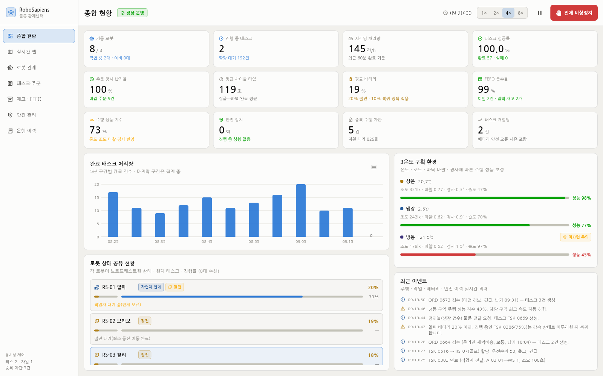

```
┌──────────┬──────────────────────────────────────────────────────────┐
│          │  상단 바 : 화면 제목 · 운영 상태 · 시계 · 배속 · ⏸ · 비상정지  │
│  사이드   ├──────────────────────────────────────────────────────────┤
│   바     │  상황 배너 (안전 상황 발생 시에만 표시)                      │
│ (7개 화면)├──────────────────────────────────────────────────────────┤
│          │                                                          │
│  동시성   │                    본문 (선택한 화면)                     │
│  제어 요약 │                                                          │
└──────────┴──────────────────────────────────────────────────────────┘
```

### 상단 바

| 요소 | 설명 |
|---|---|
| **정상 운영 / 비상정지** | 전체 시스템 상태. 비상정지 중에는 빨간색으로 바뀝니다. |
| **시계** | 시뮬레이션 시각(시:분:초). 배속에 따라 실제 시간보다 빠르게 흐릅니다. |
| **1× 2× 4× 8×** | 시뮬레이션 배속. 기본 4×(실제 1초 = 시뮬레이션 4초). 배터리·처리량 변화를 빨리 보려면 8×로 올리세요. |
| **⏸ / ▶** | 일시정지·재개. 화면을 자세히 들여다볼 때 사용합니다. **일시정지 중에도 모든 조작은 가능합니다.** |
| **전체 비상정지** | 전 로봇 동력 차단. 다시 누르면 해제됩니다. |

### 사이드바

7개 화면을 전환합니다. 하단에는 항상 **동시성 제어 요약**이 표시됩니다.

- **리스 n** — 현재 소유권이 걸린 태스크 수
- **자원 n** — 현재 점유 중인 랙 슬롯·도크 수
- **중복 차단 n건** — 두 로봇이 같은 태스크를 집으려다 반려된 누적 횟수

이 숫자가 계속 올라간다는 것은 **중복 수행 방지 장치가 실제로 작동 중**이라는 뜻입니다.
0에서 멈춰 있다면 로봇 대수 대비 태스크가 적어 경합이 없는 상태입니다.

---

## 3. 기호·색상 범례

### 상태 색상 (4단계 고정)

| 색 | 의미 | 예 |
|---|---|---|
| 🟢 초록 | 정상 | 배터리 45% 초과, 성능 지수 75% 이상 |
| 🟡 노랑 | 주의 | 배터리 20% 이하(절전), 바닥 미끄럼 |
| 🟠 주황 | 경고 | 배터리 45% 이하, 온도 이탈, 자원 대기 |
| 🔴 빨강 | 위험 | 배터리 10% 이하, 오류, 비상정지, 화재 |

> 색상은 **항상 라벨이나 아이콘과 함께** 표시됩니다. 색만으로 판단할 필요가 없습니다.

화면은 밝은 배경(라이트 테마) 기준입니다. 흰 배경에서 원색 그대로는 대비가
부족한 색(노랑·청록·자홍 계열)이 있어, **글자와 아이콘에는 어둡게 보정한 값**을
쓰고 지도 마커·막대처럼 면적이 있는 요소에만 원색을 씁니다.

### 로봇 상태

| 아이콘 | 상태 | 의미 |
|---|---|---|
| ⏸ | 대기 | 태스크 없음, 배정 가능 |
| ➤ | 주행 | 경로를 따라 이동 중 |
| ⬇ / ⬆ | 집품 / 하역 | 랙·도크에서 작업 중 |
| 🤝 | 작업자 인계 | 사람에게 물건을 건네는 중 |
| ⏵ | 보행자 양보 | 작업자·선행 로봇 때문에 감속·정지 |
| ⛔ | 자원 대기 | 다른 로봇이 점유한 랙 슬롯이 풀리길 대기 |
| ↩ | 충전소 복귀 | 배터리 10% 이하로 복귀 중 |
| ⚡ | 충전 | 충전소 도킹 중 (95%까지) |
| 🍃 | 절전 | 배터리 20% 이하, 감속 운행 |
| ⚠ | 오류 | 작업 실패 후 복구 대기(약 8초) |
| ✋ | 비상정지 | 안전 정책에 의해 정지 |
| 🌙 | 예비 대기 | 투입 대기 중인 예비기 |

### 지도 기호

| 표시 | 의미 |
|---|---|
| 원형 마커 | 로봇. **테두리 링이 배터리 잔량**, 짧은 선이 진행 방향 |
| 원 주위의 노란 테두리 | 안전 필드에 걸려 감속·정지 중 |
| 흰색 이중 원 | 현재 선택된 로봇 |
| 분홍 점 + 옅은 원 2겹 | 작업자와 안전 필드(안쪽 보호 1.7 m / 바깥 경고 4 m) |
| 실선 | 로봇의 남은 주행 경로. 선택한 로봇은 더 굵게 표시 |
| 회색 실선 | 선택한 로봇의 **지나온 궤적**(최근 200 지점) |
| 노란 점 | 현재 점유 중인 랙 슬롯 |
| 큰 반투명 원 | 안전 상황 영향 반경 |
| 어두워진 구획 | 전원이 차단된 구획 |

---

## 4. 화면별 사용법

### 4.1 종합 현황


한 화면에서 센터 전체를 파악하는 기본 화면입니다.

**지표 타일 12개** — 각 타일의 작은 글씨(보조 설명)에 판단 근거가 들어 있습니다.

| 타일 | 이렇게 읽으세요 |
|---|---|
| 가동 로봇 | `5 / 8` = 8대 중 5대 가동. 보조 설명의 "예비 n대"가 늘면 작업량이 줄었다는 뜻 |
| 진행 중 태스크 | 보조 설명의 **할당 대기**가 계속 늘면 로봇이 부족한 상황 |
| 시간당 처리량 | 최근 60분 완료 건수. 아래 차트와 같은 데이터 |
| 태스크 성공률 | 95% 미만이면 주황. 오류가 잦은 로봇을 확인하세요 |
| 주문 정시 납기율 | 90% 미만이면 주황. 긴급 주문이 밀리고 있다는 신호 |
| FEFO 준수율 | 100% 미만이면 1순위 로트가 점유돼 차순위를 쓴 것. 이력에 사유가 남습니다 |
| 주행 성능 지수 | 3개 구획 평균. 떨어지면 오른쪽 환경 패널에서 원인 구획을 찾으세요 |
| 안전 정지 | 누적 횟수. 급증하면 작업자 동선과 로봇 경로가 겹치고 있다는 뜻 |
| 중복 수행 차단 | 동시 점유 시도가 반려된 횟수. 정상 작동 지표입니다 |
| 태스크 재할당 | 배터리·안전·오류로 반환된 태스크 수 |

**완료 태스크 처리량 차트**
- 5분 구간별 완료 건수입니다. **막대에 마우스를 올리면** 해당 구간의 완료/실패 건수가 표시됩니다.
- 마지막 막대는 테두리만 있는 형태로, **아직 집계 중**임을 뜻합니다.
- 우측 상단 ▤ 버튼으로 **표 보기**로 전환할 수 있습니다.

**3온도 구획 환경** — 구획별 온도·조도·마찰·경사와 종합 성능 지수.
오른쪽에 `온도 이탈` `미끄럼 주의` `전원 차단` 배지가 뜨면 해당 구획의 로봇 속도가
자동으로 낮아진 상태입니다.

**로봇 상태 공유 현황** — 로봇을 클릭하면 선택 상태가 되어 지도·상세 화면과 연동됩니다.

**최근 이벤트** — 모든 이력의 최신 40건. 전체 조회는 [운행 이력] 화면에서 합니다.

---

### 4.2 실시간 맵

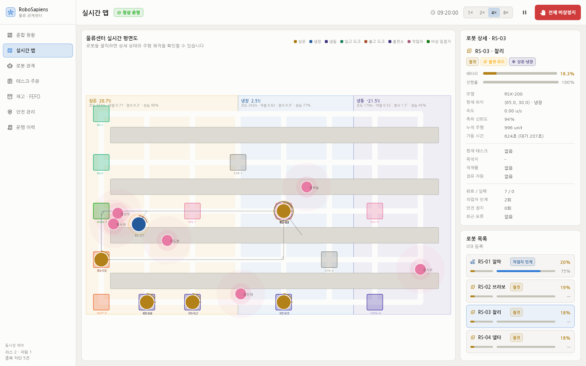

센터 평면도 위에서 실제로 무슨 일이 벌어지는지 봅니다.

| 조작 | 결과 |
|---|---|
| 로봇 위에 마우스 올리기 | 상태·배터리·속도·태스크·진행률 툴팁 |
| 로봇 클릭 | 선택 → 오른쪽 상세 패널 표시, 지나온 궤적 표시 |
| 빈 곳 클릭 | 선택 해제 |

**이런 장면을 찾아보세요**

- 작업자에게 로봇이 다가가면 **원 주위에 노란 테두리**가 생기고 멈춥니다 → 보호 필드 작동
- 로봇 두 대가 같은 통로에서 만나면 뒤쪽이 느려집니다 → 교통 양보
- 냉동 구역(오른쪽) 로봇이 눈에 띄게 느립니다 → 마찰 0.52·조도 180 lx의 영향
- 랙에 노란 점이 켜지면 그 슬롯은 한 대만 접근할 수 있습니다 → 자원 점유

오른쪽 상세 패널의 **충전소 회수** / **투입 재개** 버튼으로 개별 로봇을 직접 제어할 수 있습니다.

---

### 4.3 로봇 관제

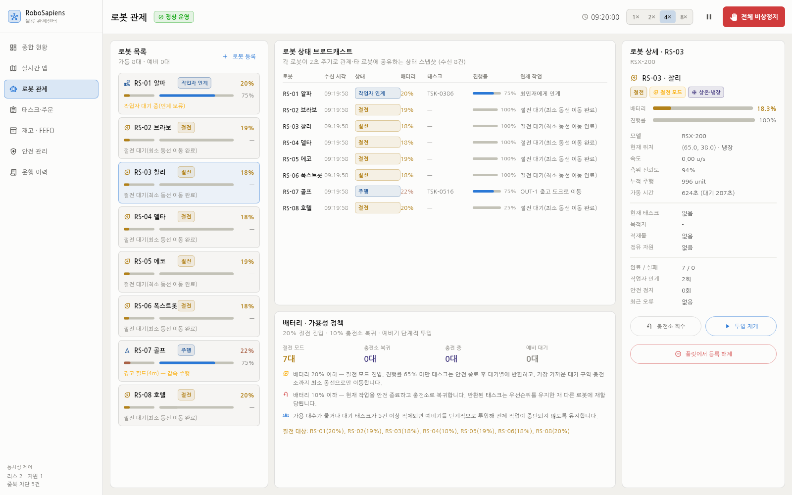

**로봇 상태 브로드캐스트** 표가 이 화면의 핵심입니다.
각 로봇이 2초마다 관제와 다른 로봇에게 보내는 상태 스냅샷을 그대로 보여줍니다.

| 열 | 의미 |
|---|---|
| 수신 시각 | 마지막 상태 수신 시각. 멈춰 있으면 통신 이상 |
| 상태 / 배터리 | 현재 상태와 잔량 |
| 태스크 / 진행률 | **작업 여부만이 아니라 무슨 작업을 몇 % 하고 있는지** |
| 현재 작업 | 진행 중인 스텝 설명 (예: `C-02-07에서 우유 3개 집품`) |
| 점유 자원 | 이 로봇이 잠그고 있는 랙 슬롯·도크 |

**배터리·가용성 정책** 패널에서 절전·복귀·충전·예비 대수를 한눈에 확인하고,
현재 적용 중인 정책 3가지를 볼 수 있습니다.

#### 로봇 등록

`로봇 목록` 패널 우측 상단의 **+ 로봇 등록** 버튼으로 신규 장비를 플릿에 추가합니다.

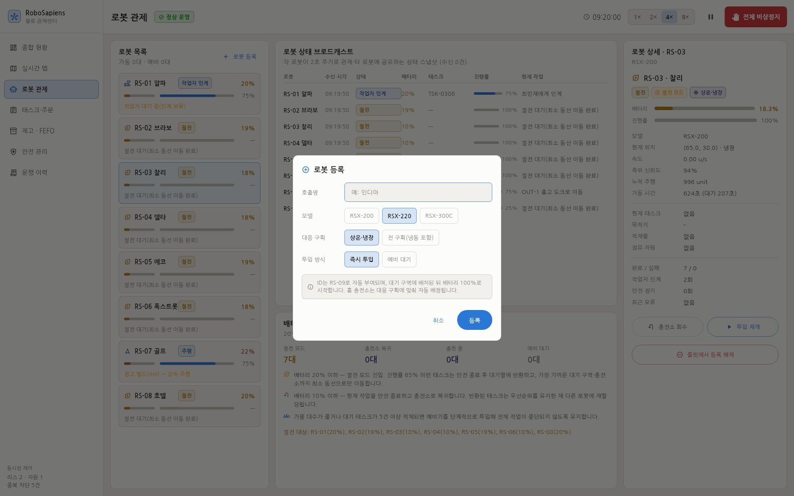

| 항목 | 설명 |
|---|---|
| 호출명 | 관제에서 부르는 이름. 비우면 `신규기`로 등록됩니다 |
| 모델 | `RSX-300C`처럼 `C`로 끝나는 냉동 대응 모델을 고르면 대응 구획이 자동으로 전 구획이 됩니다 |
| 대응 구획 | `상온·냉장`만 대응하는 장비는 냉동 구역 태스크 입찰에서 제외됩니다 |
| 투입 방식 | `즉시 투입`은 바로 스케줄링 대상, `예비 대기`는 적체·배터리 저하 시 자동 투입됩니다 |

ID(`RS-09`, `RS-10` …)는 기존 번호와 겹치지 않게 자동 부여되고, 대기 구역에 배터리
100%로 배치됩니다. 홈 충전소는 대응 구획에 맞춰 자동 배정됩니다.

#### 로봇 등록 해제

오른쪽 상세 패널 맨 아래 **플릿에서 등록 해제** 버튼을 누릅니다. 확인 대화상자에서
진행 중인 태스크가 있으면 경고와 함께 진행률을 보여줍니다.

해제 시 자동으로 처리되는 것:

- 진행 중이던 태스크는 **안전 종료 후 대기열로 반환**되어 다른 로봇에 재할당됩니다
- 점유 중이던 **태스크 리스·랙 슬롯·충전소**가 모두 회수됩니다
- 상태 브로드캐스트 목록과 지도에서 즉시 제거됩니다
- 해제 사유가 운행 이력에 기록됩니다

> 폐기가 아니라 일시 정비라면 해제 대신 **충전소 회수**를 쓰세요. 로봇이 플릿에
> 남아 있어 정비 후 **투입 재개**로 바로 복귀시킬 수 있습니다.

> **관찰 팁**: 8× 배속으로 2~3분 두면 로봇이 차례로 20% → 절전 → 10% → 복귀 →
> 충전 사이클에 진입하고, 그때마다 예비기가 투입되는 것을 볼 수 있습니다.

---

### 4.4 태스크·주문

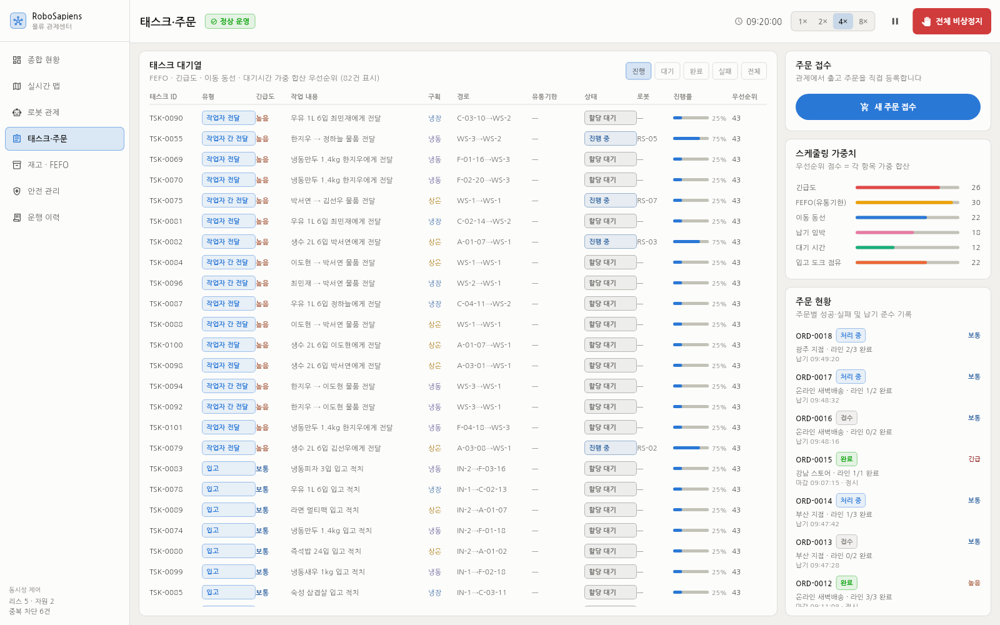

**필터** — `진행` `대기` `완료` `실패` `전체`. 기본값은 `진행`입니다.
`진행`과 `대기`에서는 **우선순위 점수 내림차순**으로 정렬됩니다. 즉 맨 위가 다음에 처리될 작업입니다.

#### 주문 접수

오른쪽 **새 주문 접수** 버튼으로 출고 주문을 직접 등록합니다.

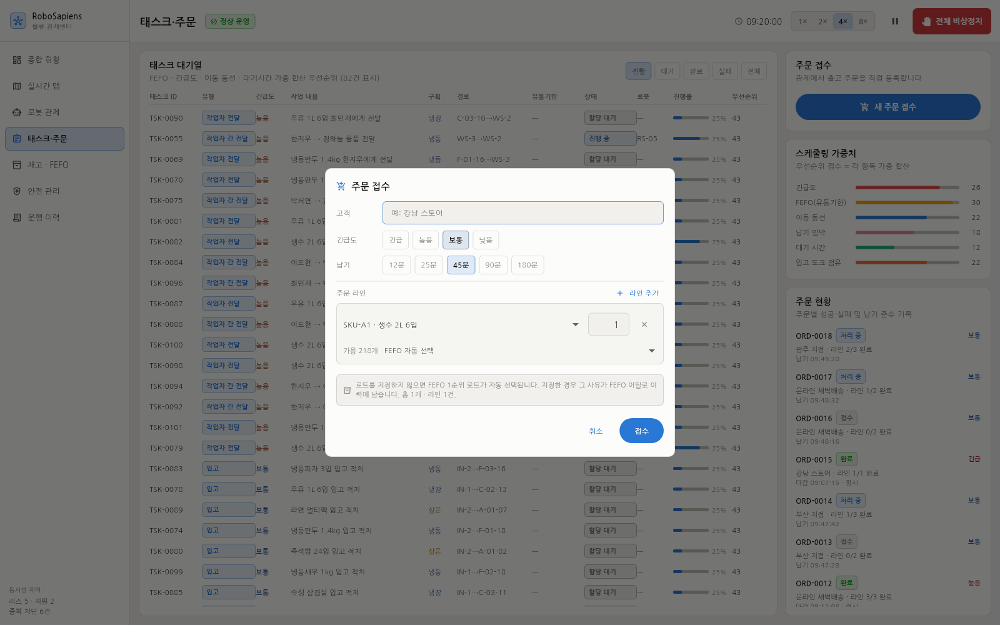

- 고객·긴급도·납기를 지정하면 납기는 긴급도에 맞춰 자동 제안됩니다
- **라인 추가**로 여러 SKU를 한 주문에 담습니다. 라인마다 가용 수량이 표시되고,
  요청 수량이 가용을 넘으면 테두리가 경고색으로 바뀝니다
- 로트를 비워 두면 **FEFO 1순위**가 자동 선택됩니다. 특정 로트를 지정하면
  그 사유가 FEFO 이탈로 이력에 남습니다(①이 FEFO 1순위 표시)

접수 즉시 라인별 출고 태스크가 생성되어 대기열에 들어가고, 선택된 로트에 예약
수량이 잡힙니다.

**행 클릭** → 상세 대화상자

- SKU·로트·유통기한·요청자 등 전체 속성
- **스텝 진행** — 4단계 중 어디까지 끝났는지 체크 표시
- **재할당** — 현재 로봇에서 회수해 대기열로 반환합니다. 특정 로봇을 빼야 할 때 사용
- **취소** — 태스크를 폐기합니다. 예약된 재고 수량도 함께 해제됩니다

**스케줄링 가중치** 패널은 우선순위 점수가 어떻게 계산되는지 보여줍니다.
FEFO(30)가 가장 크고, 긴급도(26) · 이동 동선(22) · 납기(18) · 대기 시간(12) 순입니다.

**주문 현황** — 주문별 라인 성공/실패와 납기 준수 여부. `부분 완료`는 일부 라인이
3회 재시도를 초과해 실패한 경우입니다.

---

### 4.5 재고 · FEFO

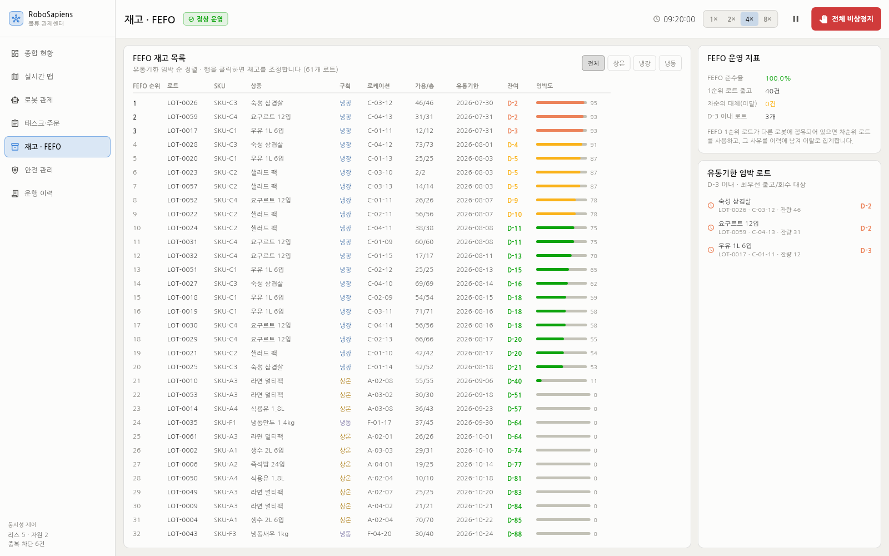

유통기한이 임박한 순으로 정렬된 재고 목록입니다. **맨 위 로트가 다음 출고 대상**입니다.

- 좌측 상단 필터로 구획(상온/냉장/냉동)을 좁힐 수 있습니다
- `가용/총` — 가용 수량은 총 수량에서 이미 출고 예약된 수량을 뺀 값입니다
- `임박도` 미터 — 유통기한 45일 기준 정규화 값. 스케줄러가 그대로 가중치로 사용합니다
- 오른쪽 **유통기한 임박 로트**는 D-3 이내 목록입니다. `경과` 표시가 뜬 로트는
  최우선 회수 태스크가 자동 발행됩니다

#### 재고 조정

**행을 클릭하면** 해당 로트의 조정 대화상자가 열립니다.

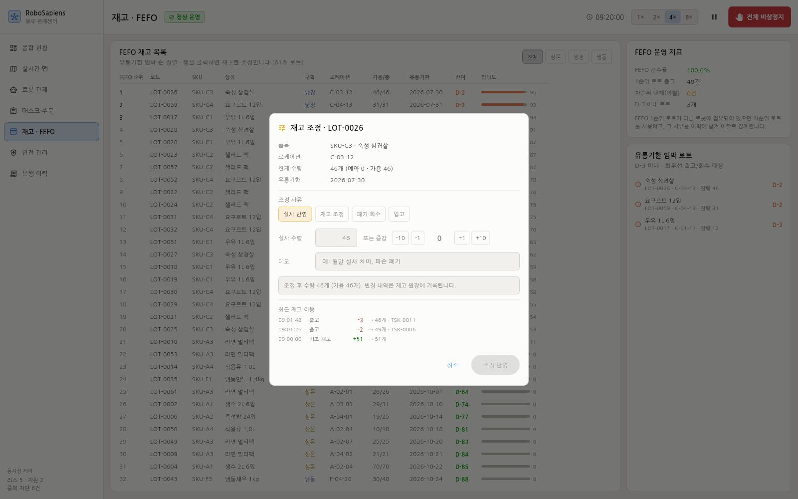

| 항목 | 설명 |
|---|---|
| 조정 사유 | `실사 반영` · `재고 조정` · `폐기·회수` · `입고` 중 선택 |
| 실사 수량 | 센 수량을 입력하면 증감이 자동 계산됩니다 |
| 증감 버튼 | `-10 / -1 / +1 / +10`으로 직접 가감 |
| 메모 | 사유를 남기면 재고 원장에 함께 기록됩니다 |
| 최근 재고 이동 | 이 로트의 최근 8건 원장. 입고·출고·조정이 시간순으로 남습니다 |

**예약 수량보다 적게 만들 수는 없습니다.** 이미 출고 태스크가 잡아 둔 수량을
없애면 그 태스크가 실패하기 때문입니다. 그런 조정은 붉은 안내와 함께 차단되고,
시도 사실이 이력에 남습니다.

모든 수량 변경은 **재고 원장(stock_moves)** 에 append-only로 기록되어
감사 추적이 가능합니다. 원장 합계는 항상 현재 수량과 일치합니다.

**FEFO 준수율이 100% 미만이라면** — 1순위 로트가 다른 로봇에 점유되어 차순위를
사용한 경우입니다. [운행 이력]에서 분류 `스케줄`, 주체 `FEFO`로 필터하면 사유가 나옵니다.

---

### 4.6 안전 관리

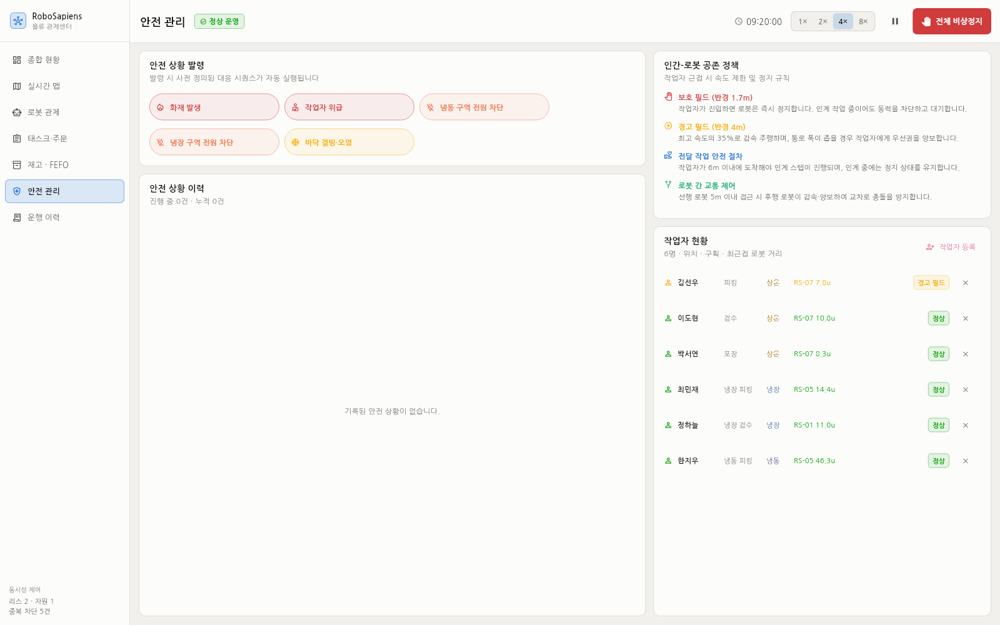

**안전 상황 발령** — 버튼을 누르면 즉시 상황이 발생하고 대응 시퀀스가 자동 실행됩니다.
버튼 위에 마우스를 올리면 어떤 조치가 실행되는지 미리 볼 수 있습니다.

| 버튼 | 즉시 일어나는 일 |
|---|---|
| **화재 발생** | 전 로봇이 진행 중 작업을 안전 종료하고 비상 집결지(ASM-1)로 대피. 신규 할당 중단 |
| **작업자 위급** | 임의의 작업자가 위급 상태가 되고, 반경 16 unit(8 m) 내 모든 로봇 즉시 정지 |
| **냉동/냉장 구역 전원 차단** | 해당 구획 로봇 정지, 조도 45 lx로 하락, 지도에서 구획이 어두워짐 |
| **바닥 결빙·오염** | 마찰계수가 급락해 해당 구획 속도가 자동 제한됨 |

아래는 **작업자 위급** 상황을 발령한 직후의 화면입니다. 상단에 붉은 배너가 뜨고,
이력 카드에 자동 실행된 조치 4건이 남으며, 오른쪽 작업자 목록에서 해당 작업자가
`위급`으로, 반경 안의 다른 작업자가 `경고 필드`로 표시됩니다.

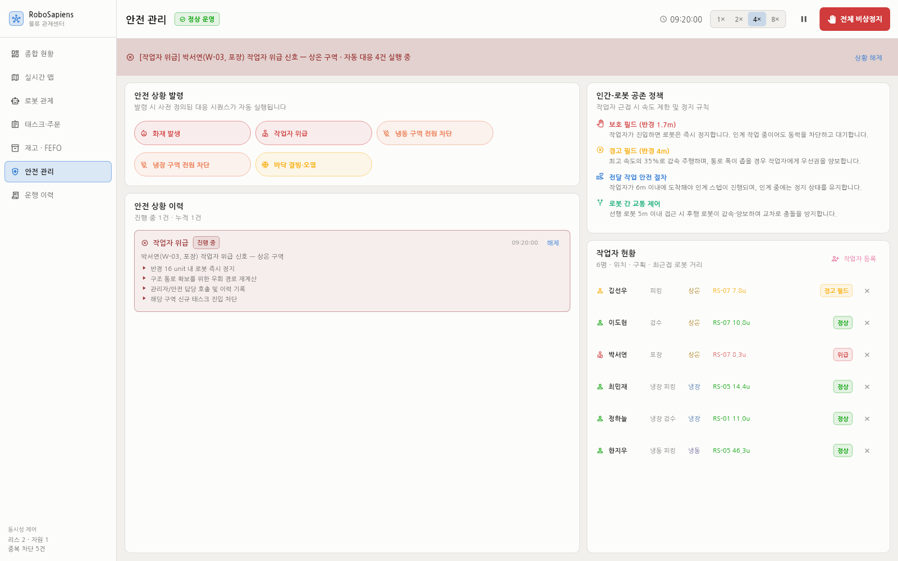

**해제 방법** — 상단 배너의 `상황 해제` 또는 이력 카드의 `해제` 버튼.
해제하면 보류된 태스크가 다시 배정되고 정상 운영으로 복귀합니다.

**안전 상황 이력** — 카드마다 자동 실행된 조치가 체크리스트로 남습니다.
진행 중이면 ▶, 종료되면 ✓ 로 표시됩니다.

**작업자 현황** — 작업자별 최근접 로봇과 거리, 그리고 어느 필드에 걸려 있는지
(`정상` / `경고 필드` / `보호 필드` / `위급`)를 실시간으로 보여줍니다.

#### 작업자 등록·해제

패널 우측 상단 **+ 작업자 등록** 버튼으로 현장 인원을 추가합니다.

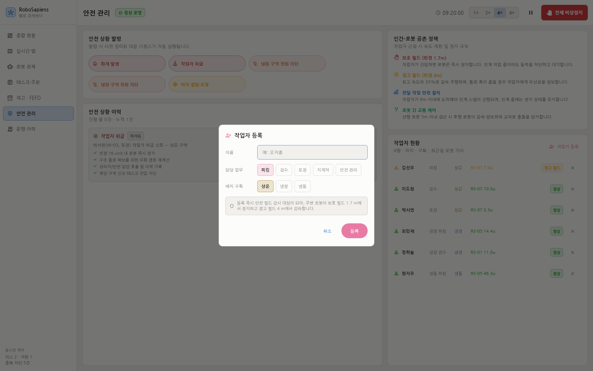

이름·담당 업무·배치 구획을 지정하면 등록 즉시 **안전 필드 감시 대상**이 되어,
주변 로봇이 보호 필드 1.7 m에서 정지하고 경고 필드 4 m에서 감속합니다.

각 행 오른쪽 **×** 버튼으로 해제합니다. 위급 상태로 등록된 작업자를 해제하면
관련 안전 상황도 함께 종료됩니다.

---

### 4.7 운행 이력

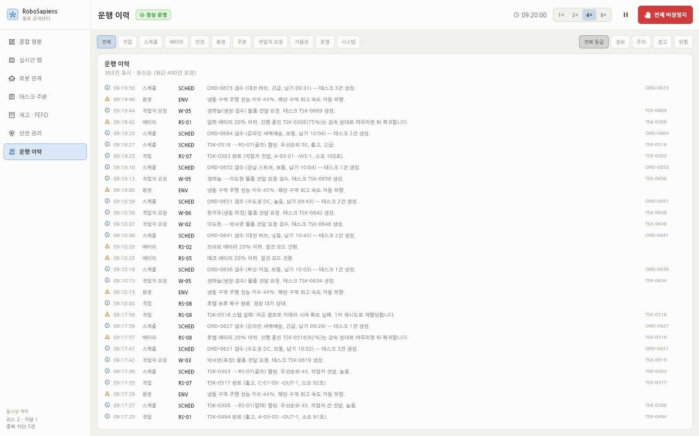

전체 이벤트를 분류·심각도로 필터해 조회합니다. 최근 400건이 보관됩니다.

**분류별로 이런 것을 확인합니다**

| 분류 | 내용 |
|---|---|
| 스케줄 | 태스크 생성·할당·리스 충돌 반려·FEFO 이탈 |
| 작업 | 태스크 완료(소요 시간 포함)·스텝 실패·재시도 |
| 배터리 | 20% 절전 진입·10% 복귀·충전 완료 |
| 안전 | 상황 발생·해제 |
| 환경 | 온도 이탈·성능 지수 저하 |
| 주문 | 주문 마감(성공/실패 라인 수, 납기 준수) |
| 작업자 요청 | 전달·중계 요청 접수 |
| 가용성 | 예비기 투입·예비 대기 전환 |
| 운영 | 관제 요원의 수동 조작 |

각 행 오른쪽 끝에 연관 태스크·주문 ID가 표시되므로, 해당 화면에서 교차 확인할 수 있습니다.

---

## 5. 상황별 대응 절차

### 처리량이 떨어졌다

1. [종합 현황] **할당 대기** 건수 확인 → 많다면 로봇 부족
2. [로봇 관제] 절전·복귀·충전 대수 확인 → 배터리 사이클이 몰린 것인지 판단
3. 예비기가 남아 있으면 자동 투입되지만, 즉시 필요하면 상세 패널에서 **투입 재개**
4. [종합 현황] **주행 성능 지수** 확인 → 낮다면 특정 구획의 환경 문제

### 특정 로봇이 계속 멈춰 있다

1. [실시간 맵]에서 해당 로봇 선택 → 상세 패널의 **안전 메모** 확인
   - `보호 필드` → 작업자가 옆에 있음. 정상 동작입니다
   - `선행 로봇 양보` → 교통 정체. 곧 풀립니다
2. 상태가 `자원 대기`라면 다른 로봇이 같은 랙을 쓰는 중입니다. 점유 자원 ID를 확인하세요
3. 상태가 `오류`라면 최근 오류 사유를 확인하고, 반복된다면 해당 로봇을 **충전소 회수** 후 점검

### 긴급 주문이 밀린다

1. [태스크·주문]에서 필터 `진행` → 우선순위 점수 최상단 확인
2. 긴급 주문 태스크가 위에 없다면 **재할당**으로 대기열에 되돌려 즉시 재평가
3. 대기 시간 가중치(12)가 있어 오래된 태스크는 자동으로 순위가 올라갑니다

### 화재 훈련을 하고 싶다

1. [안전 관리] → **화재 발생**
2. [실시간 맵]으로 전환 → 전 로봇이 ASM-1로 모이는 것을 확인
3. [안전 관리]에서 실행된 조치 체크리스트 확인
4. 배너의 **상황 해제** → 태스크가 다시 배정되는지 [운행 이력]에서 확인

---

## 6. 자주 묻는 질문

**Q. 숫자가 너무 빨리 변합니다.**
상단 바에서 배속을 `1×`로 낮추거나 `⏸`로 일시정지하세요. 일시정지 중에도 화면 전환·선택·조회는 모두 됩니다.

**Q. 로봇이 랙을 뚫고 지나가지 않는 이유는?**
모든 이동은 통로 교차점 그래프 위의 최단 경로를 따릅니다. 스케줄러가 계산하는 이동 비용도 직선거리가 아니라 이 실제 경로 길이입니다.

**Q. 냉동 구역 로봇만 배터리가 빨리 닳습니다.**
의도된 동작입니다. 저온에서 소모율이 1.35배(냉장 1.12배) 적용됩니다.

**Q. 태스크가 실패했는데 다시 나타납니다.**
2회까지 자동 재시도합니다. 3회를 초과하면 최종 실패로 확정되고 주문 라인도 실패 처리됩니다.

**Q. 로봇을 추가했는데 일을 안 합니다.**
`예비 대기`로 등록했는지 확인하세요. 예비기는 대기 태스크가 5건 이상 쌓이거나 다른 로봇의 배터리가 떨어질 때 자동 투입됩니다. 즉시 투입하려면 상세 패널의 **투입 재개**를 누르세요.

**Q. 로봇을 해제하면 하던 작업은 어떻게 되나요?**
사라지지 않습니다. 안전 종료 후 대기열로 반환되어 우선순위를 유지한 채 다른 로봇에 재할당됩니다. [운행 이력]에서 해제 기록과 반환된 태스크 ID를 확인할 수 있습니다.

**Q. 데이터는 어디에 저장되나요?**
SQLite 파일입니다. 기본 경로는 `~/.local/share/robo_control/robo_control.db`이며, 환경 변수 `ROBOAPP_DB_DIR`로 바꿀 수 있습니다. 앱을 껐다 켜도 재고·주문·태스크·로봇·이력이 그대로 남습니다.

**Q. 재기동하면 진행 중이던 작업은 어떻게 되나요?**
관제가 내려간 사이 로봇 상태를 신뢰할 수 없으므로, 진행 중이던 태스크는 모두 **대기열로 회수**되어 다시 할당됩니다. 완료·실패 기록과 재고는 그대로 유지됩니다.

**Q. 지표를 초기화하려면?**
DB 파일을 지우면 기초 데이터부터 다시 시작합니다. 앱 재시작만으로는 초기화되지 않습니다.

**Q. 실제 로봇에 연결할 수 있나요?**
현재는 시뮬레이터 기반입니다. 실 장비 연동에 필요한 작업은
[PROJECT_SUMMARY.md §10](PROJECT_SUMMARY.md#10-한계와-향후-과제)에 정리되어 있습니다.
